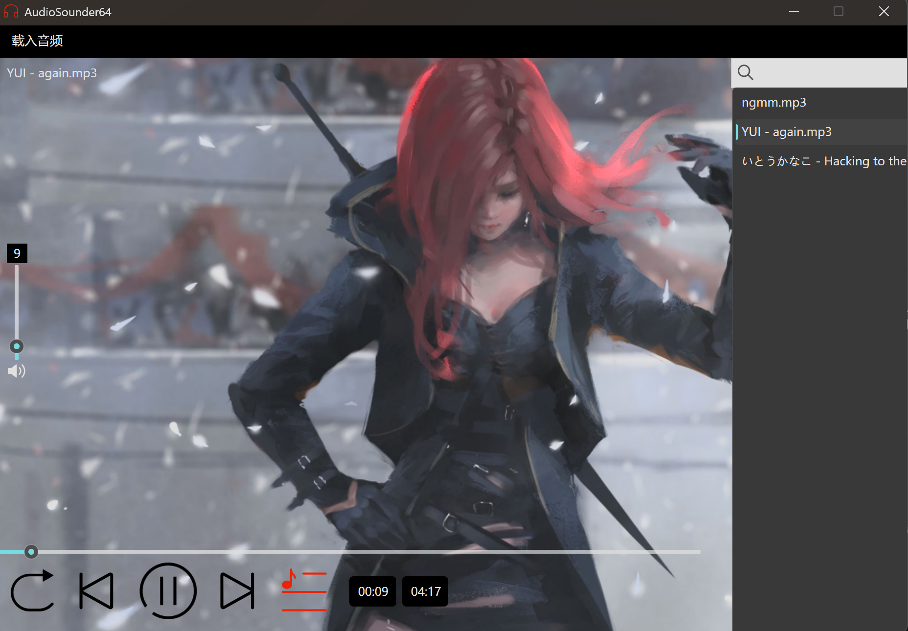

# AudioSounder64

一款基于 Qt6 的轻量级本地文件夹音乐播放器 —— 选择文件夹即生成歌单，开箱即用，状态自动记忆。

A lightweight local folder-based music player built with Qt 6 — pick a folder, get a playlist, everything is remembered automatically.

## 界面预览 / Preview



## 功能特性 / Features

| 中文 | English |
| ---- | ------- |
| 选择文件夹一键生成歌单 | Load any folder as a playlist in one click |
| 三种播放模式：顺序 / 随机 / 单曲循环 | Three play modes: Sequence / Random / Single Loop |
| 播放 / 暂停、上一曲 / 下一曲 | Play / pause, previous / next track |
| 进度条拖动跳转，实时显示当前时间与总时长 | Seekable progress bar with live current / total time |
| 歌单实时搜索过滤（大小写不敏感），清空后高亮回到当前曲目 | Case-insensitive live playlist filtering, highlight returns to the current track when cleared |
| 音量条 + 一键静音，音量与静音状态自动记忆 | Volume slider + one-click mute, volume & mute state persisted |
| 记住上次打开的文件夹，启动即恢复 | Remembers the last opened folder across restarts |
| 支持 mp3 / wav / flac / aac / m4a / ogg / wma | Supports mp3 / wav / flac / aac / m4a / ogg / wma |

## 构建 / Build

环境要求 / Requirements:

- Qt 6.x（Widgets + Multimedia）
- CMake ≥ 3.16
- 编译器 / Compiler: MSVC 2022 或 MinGW（推荐 MSVC）

步骤 / Steps:

```bash
cmake -S . -B build -G Ninja -DCMAKE_PREFIX_PATH="D:/Qt/6.x.x/msvc2022_64"
cmake --build build
```

运行 / Run:

```bash
build/AudioSounder64.exe
```

发布打包（复制依赖库）/ Deployment:

```bash
windeployqt build/AudioSounder64.exe
```

## 使用说明 / Usage

1. 菜单栏 **载入音频 → 添加文件夹**，选择一个存放音乐的文件夹；
2. 点击右侧列表按钮展开歌单，可在顶部搜索框实时过滤曲目；
3. 底部控制区可切换播放模式、拖动进度条、调节音量或一键静音；
4. 关闭程序后，文件夹、音量、静音状态都会自动保存。

---

1. Menu bar **Load Audio → Add Folder**, pick a folder containing music;
2. Click the list button on the right to open the playlist; filter tracks live with the search box on top;
3. Use the bottom control bar to switch play modes, seek, adjust volume, or mute;
4. Folder path, volume and mute state are saved automatically when the app closes.

## 项目结构 / Project Structure

```
AudioSounder64/
├── MusicPlayer.ui          # 界面文件 / UI layout
├── MusicPlayer.h/.cpp      # 主窗口逻辑 / Main window logic
├── main.cpp
├── CMakeLists.txt
└── Resource/
    ├── ICON/               # 按钮图标（qrc）/ Button icons (qrc)
    └── IMG/                # 背景图（qrc）/ Background image (qrc)
```

## 路线图 / Roadmap

- [ ] 歌词显示 / Lyrics display
- [ ] 系统托盘与全局快捷键 / System tray & global hotkeys
- [ ] 播放队列拖拽排序 / Drag & drop playlist sorting
- [ ] 深色主题 / Dark theme

## 许可证 / License

[MIT](LICENSE)
